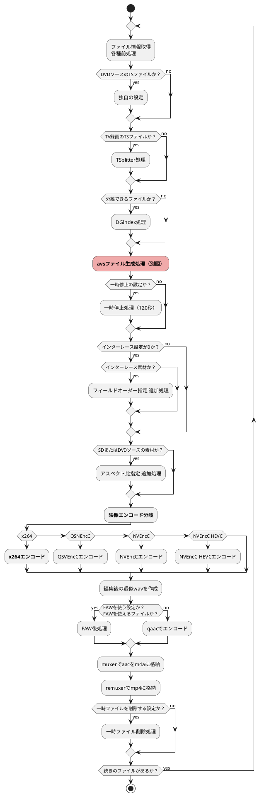

```puml
@startuml

start

repeat

:ファイル情報取得
各種前処理;

if (DVDソースのTSファイルか？) then (yes)
  :独自の設定;
else (no)
endif

if (TV録画のTSファイルか？) then (yes)
  :TSplitter処理;
else (no)
endif

if (分離できるファイルか？) then (yes)
  :DGIndex処理;
else (no)
endif

#f0aaaa:**avsファイル生成処理**（**別図**）;

if (一時停止の設定か？) then (yes)
  :一時停止処理（120秒）;
else (no)
endif

if (インターレース設定が0か？) then (yes)
  if (インターレース素材か？) then (yes)
    :フィールドオーダー指定 追加処理;
  endif
else (no)
endif

if (SDまたはDVDソースの素材か？) then (yes)
  :アスペクト比指定 追加処理;
endif

:**映像エンコード分岐**;

if (x264) then
  :**x264エンコード**;
elseif (QSNEncC) then
  :QSVEncCエンコード;
elseif (NVEncC)
  :NVEncCエンコード;
elseif (NVEncC HEVC)
  :NVEncC HEVCエンコード;
endif

:編集後の疑似wavを作成;

if (FAWを使う設定か？
FAWを使えるファイルか？) then (yes)
  :FAW後処理;
else (no)
  :qaacでエンコード;
endif

:muxerでaacをm4aに格納;
:remuxerでmp4に格納;

if (一時ファイルを削除する設定か？) then (yes)
  :一時ファイル削除処理;
else (no)
endif

repeat while (続きのファイルがあるか？) is (yes)

stop

@enduml
```
