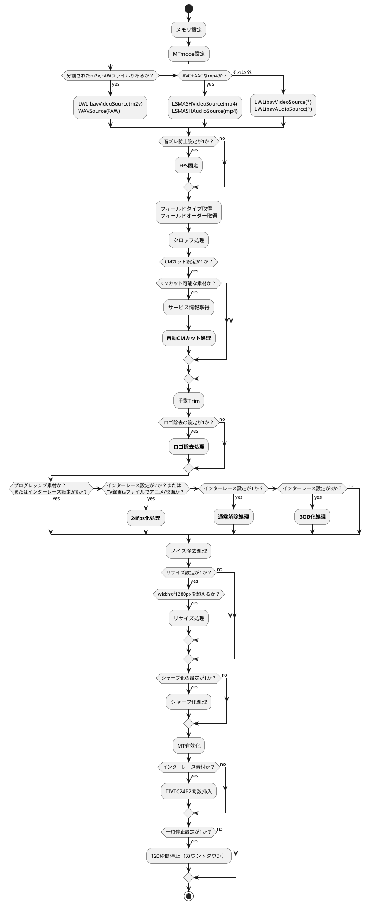

```puml
@startuml

start

:メモリ設定;

:MTmode設定;

if (分割されたm2v,FAWファイルがあるか？) then (yes)
  :LWLibavVideoSource(m2v)
  WAVSource(FAW);
elseif (AVC+AACなmp4か？) then (yes)
  :LSMASHVideoSource(mp4)
  LSMASHAudioSource(mp4);
else (それ以外)
  :LWLibavVideoSource(*)
  LWLibavAudioSource(*);
endif


if (音ズレ防止設定が1か？) then (yes)
  :FPS固定;
else (no)
endif

:フィールドタイプ取得
フィールドオーダー取得;

:クロップ処理;

if (CMカット設定が1か？) then (yes)
  if (CMカット可能な素材か？) then (yes)
    :サービス情報取得;
    :**自動CMカット処理**;
  endif
endif

:手動Trim;

if (ロゴ除去の設定が1か？) then (yes)
  :**ロゴ除去処理**;
else (no)
endif

if (プログレッシブ素材か？
またはインターレース設定が0か？) then (yes)
elseif (インターレース設定が2か？または
TV録画tsファイルでアニメ/映画か？) then (yes)
  :**24fps化処理**;
elseif (インターレース設定が1か？) then (yes)
  :**通常解除処理**;
elseif (インターレース設定が3か？) then (yes)
  :**BOB化処理**;
else (no)
endif

:ノイズ除去処理;

if (リサイズ設定が1か？) then (yes)
  if (widthが1280pxを超えるか？) then (yes)
    :リサイズ処理;
  endif
else (no)
endif

if (シャープ化の設定が1か？) then (yes)
  :シャープ化処理;
else (no)
endif

:MT有効化;

if (インターレース素材か？) then (yes)
  :TIVTC24P2関数挿入;
else (no)
endif

if (一時停止設定が1か？) then (yes)
  :120秒間停止（カウントダウン）;
else (no)
endif

stop

@enduml
```
